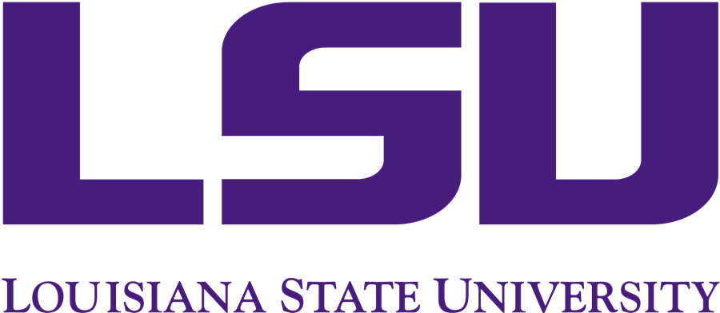

# DeepFE: Deep Learning for Frog Eggs Quantification

The Aquatic Department at LSU (AGGRC), works to address the lack of standardization and reproducibility in cryopreservation for aquatic species. Hence, the statistics of the eggs to be preserved is important for record. Our mission was to develop software capable of accurately counting frog eggs in images using deep learning with varying image sizes.

  

To address this, we used the architecture ``StarDist" , which has  U-Net neural network as its backbone, followed by the  Non-Maximum Suppression algorithm.  The following are references for our work.
- Uwe Schmidt, Martin Weigert, Coleman Broaddus, and Gene Myers.  
[*Cell Detection with Star-convex Polygons*](https://arxiv.org/abs/1806.03535).  
International Conference on Medical Image Computing and Computer-Assisted Intervention (MICCAI), Granada, Spain, September 2018.

- Martin Weigert, Uwe Schmidt, Robert Haase, Ko Sugawara, and Gene Myers.  
[*Star-convex Polyhedra for 3D Object Detection and Segmentation in Microscopy*](http://openaccess.thecvf.com/content_WACV_2020/papers/Weigert_Star-convex_Polyhedra_for_3D_Object_Detection_and_Segmentation_in_Microscopy_WACV_2020_paper.pdf).  
The IEEE Winter Conference on Applications of Computer Vision (WACV), Snowmass Village, Colorado, March 2020

### Training and Testing
Training on 144 images and testing on 36 images yielded us an accuracy upto 98 % accuracy.  

The following is a test image with the total count of 2006 eggs and the predicted count is 1992 eggs, which accounts for 99.3\% of the actual count.

  

---

# Made by the Summer 2023 DeVision Team

https://github.com/devision2023/Summer-Research-

## CEO
Dr. Peter Wolenski

wolenski@math.lsu.edu

## Mathematics Graduate Students:

David Agbolade, Gyaneshwar Agrahari, Kiran Bist, Hayden Bromley, Jackson Knox, Monika Pandey, Iswarya Sitiraju, Gowri Priya Sunkara

## Undergraduate Students:

Narek Bayramyan, Addison DeBlieux, Rohan Durgum, Atif Iqbal, Steph Moore, Artem Mukhamedzianov, Sunella Ramnath, Sahithi Rampally, Houston Smith, Jamar Whitfield, Skylar Wilson
 
 

LSU Math Consultation Clinic: 
https://www.math.lsu.edu/courses/capstone_course
 
 

https://lsu.edu/
